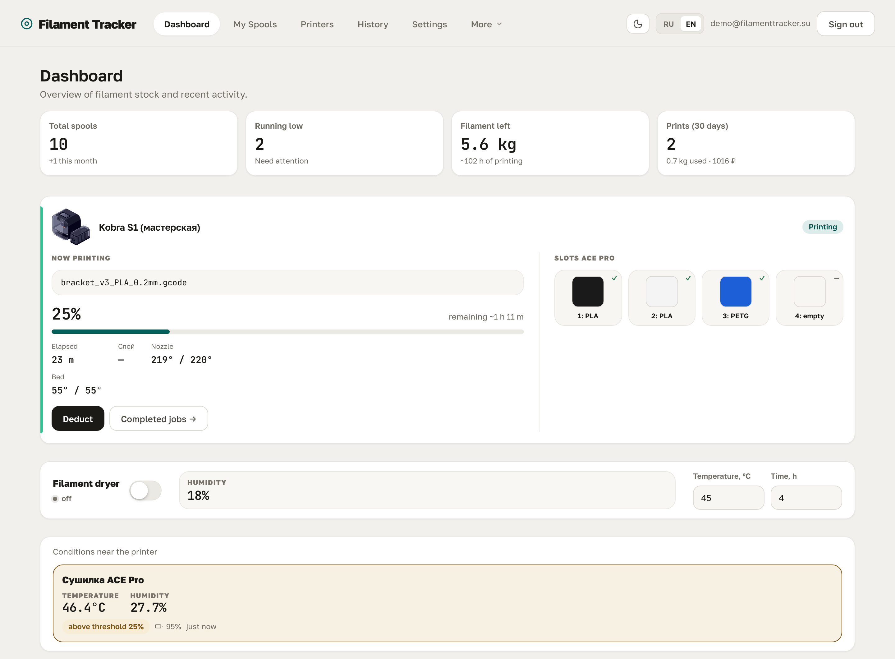
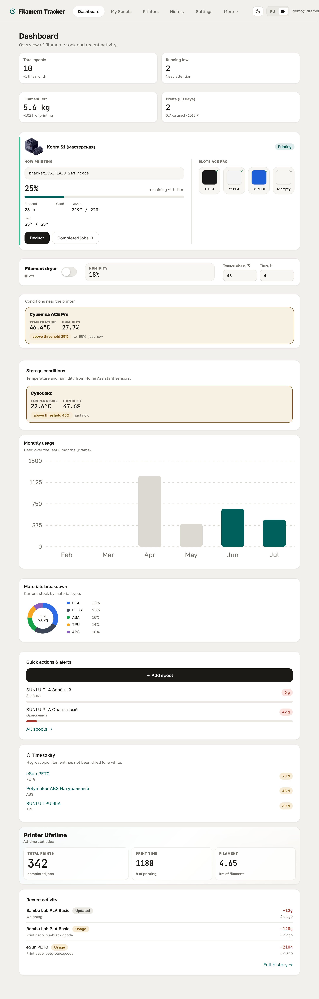
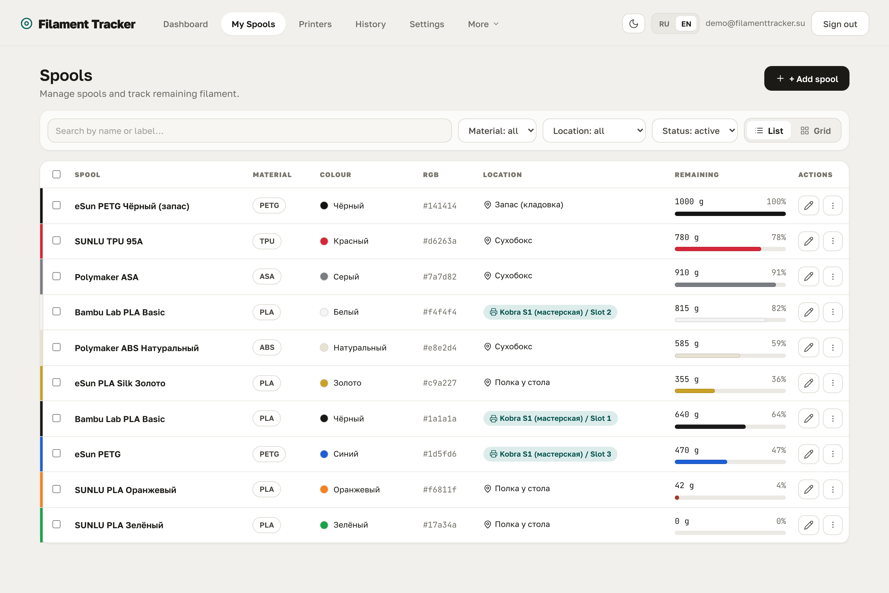
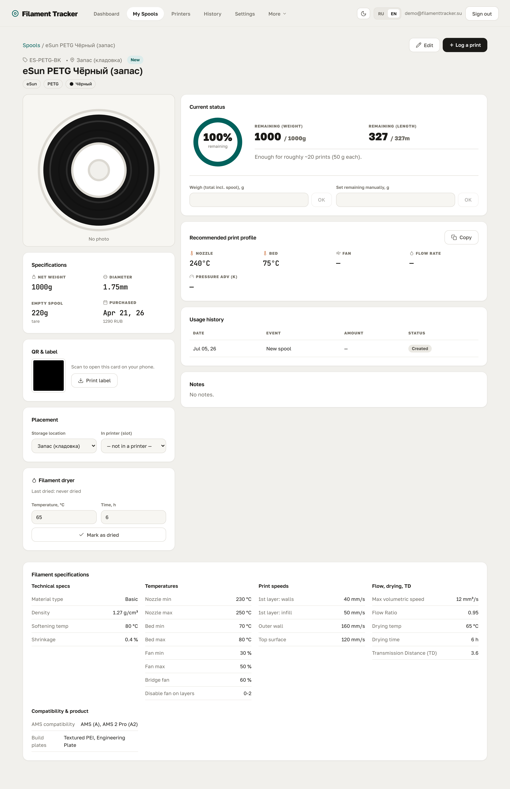
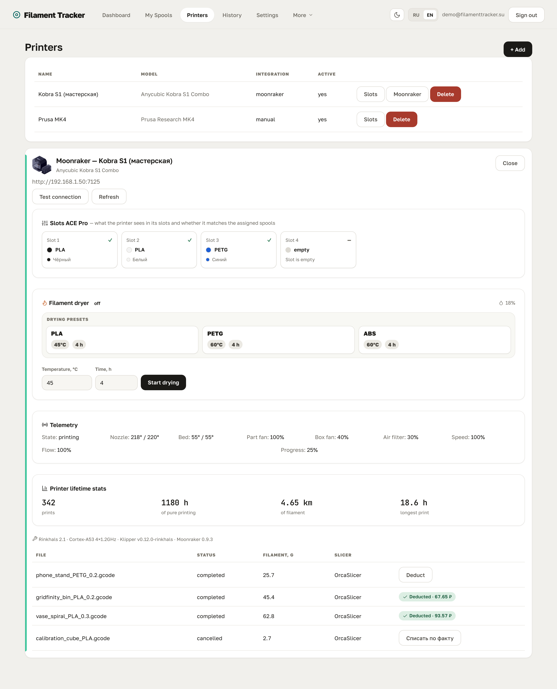
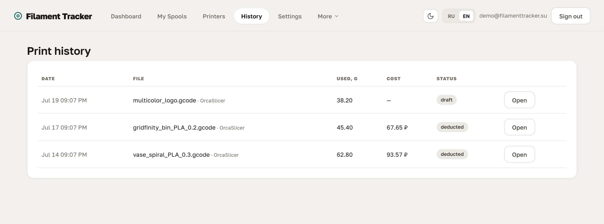
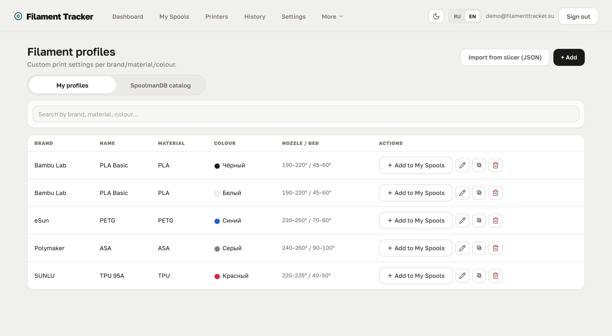
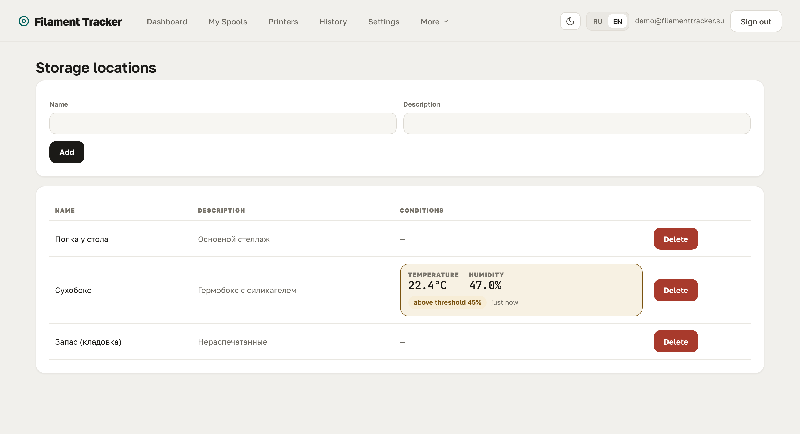
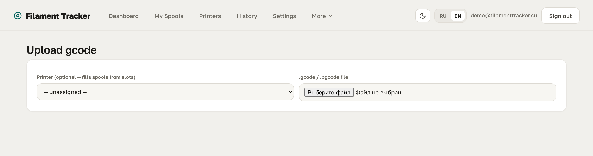
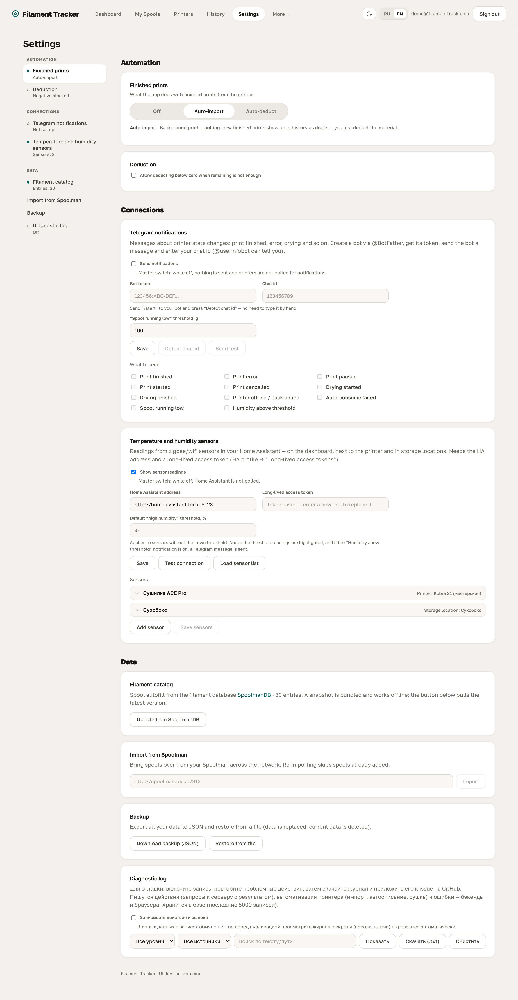

<h1 align="center">Filament Tracker</h1>

<p align="center">
  <b>Filament tracking for 3D printing that lives on your own server.</b>
</p>

<p align="center">
  <a href="https://github.com/dobriys/filament_tracker/releases"></a>
  <a href="LICENSE"></a>
  <a href="https://demo.fmtracker.ru"></a>
</p>

<p align="center">
  <a href="README.md">Русский</a> · <b>English</b>
</p>

---

How much is left on that spool? Will it last through the night? Where did all the
blue PETG go?

Filament Tracker answers those questions for you. It keeps your spool inventory,
tallies usage from your printer, and warns you when something is running low — before
you find out halfway through an overnight print.

Everything runs on your own hardware: home server, NAS, mini PC. Your data stays put.

**[Open the live demo →](https://demo.fmtracker.ru)** — the real interface on sample
data, no install needed. It runs entirely in the browser, edits are stored locally,
and "Reset demo" puts everything back.



---

## Contents

- [What it does](#what-it-does)
- [A look around](#a-look-around)
- [Install](#install)
- [First steps](#first-steps)
- [Telegram notifications](#telegram-notifications)
- [Home Assistant sensors](#home-assistant-sensors)
- [Backups](#backups)
- [When something breaks](#when-something-breaks)
- [FAQ](#faq)
- [Support the project](#support-the-project)

---

## What it does

### Inventory

- **Spool inventory** — material, color, remaining grams, storage location, photo.
  In the list, each row carries a stripe of the filament's real color, so you spot
  the spool you want without reading a single name.
- **Accurate remaining amount** — deduction by weight, manual corrections, full
  movement history.
- **Filament profiles** — brand and material templates with every temperature, so you
  don't fill in the same card twice.
- **Storage locations and printer slots** — see what's on the shelf and what's loaded.
- **Labels and QR codes** — stickers with a live preview, printed one at a time or as
  an A4 sheet. Scanning the QR opens the spool on your phone.

### Printer

- **Moonraker and Rinkhals** — live print status on the dashboard: progress, layer,
  temperatures, time remaining.
- **Printer catalog** — 50+ Klipper/Moonraker models (Anycubic, Creality, Sovol, QIDI,
  FLSUN, ELEGOO, Prusa and more). Connection type, slot count and capabilities fill
  themselves in.
- **One-click deduction** — per-extruder usage already comes from the printer; you
  just confirm which spools it came off.
- **Automatic deduction** — background polling brings finished prints in on their own,
  and when every tool matches a slot, the material is deducted without you.
- **Deduct from gcode** — no printer connected? Upload the file and the app works out
  usage per tool.

### Around the printer

- **Telegram notifications** — print finished, error, paused, drying, spool running
  low. Every event is toggled separately.
- **Home Assistant sensors** — temperature and humidity from your dryer and shelves,
  shown where they matter. Above the threshold, they light up and message you.
- **Drying control** — on compatible hubs such as the Anycubic ACE, drying starts
  right from the app, with per-material presets.

### Your data

- **Spoolman import** — pull your inventory over the network from
  [Spoolman](https://github.com/Donkie/Spoolman) in one click.
- **Backups** — export and restore everything as a single JSON file.
- **Your own server** — login-based access, printer keys stored encrypted, nothing
  leaves the machine.
- **Two languages** — English and Russian, switched on the fly.

---

## A look around

### Dashboard

Inventory at a glance: how many spools, what's running low, total remaining and how
many print hours that buys. Below it, a card per printer with live status and a
**Deduct** button that wakes up when the print is done. Then sensor readings, usage by
month, the split by material, and a feed of recent events.



### Spools

The main inventory list. Each row opens with a stripe of the filament's real color,
and the remaining bar uses that same color; as the spool runs down it turns ochre,
then red. From here you can add, edit, duplicate in another color, weigh, or print a
label.



The spool page gathers everything in one place: grams and meters remaining, the
recommended print profile, usage history, QR code, placement, and the full filament
spec sheet.



### Printers

Pick a model from the catalog when adding a printer and the rest fills itself in. Any
Klipper/Moonraker printer works, Anycubic on Rinkhals included: you only see what the
printer actually has.

The printer panel reconciles what sits in the slots against what's assigned in the
app, shows telemetry and lifetime stats, and deducts finished jobs with the button
next to them. Deducted jobs are marked and won't be counted twice. There's no limit on
how many printers you add.



### History

Every deduction and correction: when, for which print, and off which spool.



### Filament profiles

Brand and material templates: temperatures, speeds, flow, drying parameters. The
[SpoolmanDB](https://github.com/Donkie/SpoolmanDB) catalog is bundled and works
offline, so a new spool takes a couple of clicks.



### Storage locations

Shelves, boxes, dryers. If a Home Assistant sensor is bound to a location, its
temperature and humidity show right in the row.



### Gcode upload

No printer connected — no problem. Upload a gcode file, the app breaks usage down per
tool, and you match each one to a spool.



### Settings

Sections are grouped by what they actually do, and the contents rail doubles as a
status board: whether auto-import is on, whether Telegram is set up, how many sensors
you have.



---

## Install

All you need is Docker with Docker Compose — a Linux server, NAS, mini PC, anything.

```bash
git clone https://github.com/dobriys/filament_tracker.git
cd filament_tracker
./setup.sh
```

The script writes `.env`, generates secret keys, brings the containers up and prints
the address. Open **http://‹server-address›:5173** and create the administrator
account — the app offers this on first login.

Handy afterwards:

```bash
docker compose logs -f          # follow the logs
docker compose restart backend  # restart the service
docker compose down             # stop
git pull && ./setup.sh          # update to a new version
```

<details>
<summary><b>Install via Portainer</b></summary>

<br>

Paste the compose file and hit Deploy.

1. **Stacks → Add stack → Web editor**, give it a name such as `filament-tracker`.
2. Paste the contents of [`docker-compose.yml`](docker-compose.yml).
3. Expand **Environment variables** and set `POSTGRES_PASSWORD` to your own database
   password. `SECRET_KEY` and `ENCRYPTION_KEY` are optional: leave them out and the
   app generates them on first start and stores them in the database. Set them by
   hand only if you want the keys kept outside the database.
4. **Deploy the stack**, then open `http://‹server-address›:5173`.

To update: **Stacks → your stack → Pull and redeploy**.

</details>

<details>
<summary><b>Install by hand, without the script</b></summary>

<br>

```bash
git clone https://github.com/dobriys/filament_tracker.git
cd filament_tracker
cp .env.example .env

# generate the keys and put them in .env
echo "SECRET_KEY=$(openssl rand -base64 48 | tr '+/' '-_' | tr -d '=')"
echo "ENCRYPTION_KEY=$(openssl rand -base64 32 | tr '+/' '-_')"

# edit .env, then:
docker compose up -d
```

</details>

---

## First steps

1. Create the administrator account on first login.
2. Add your **storage locations** — shelves, boxes, dryers.
3. Add **spools**, either by hand or from a catalog profile so the specs fill
   themselves in.
4. Connect a **printer** by its Moonraker address under "Printers".
5. Print **labels** with QR codes and stick them on your spools.
6. Print away — then deduct from the dashboard in one click, or turn on automatic
   deduction.

---

## Telegram notifications

Create a bot with [@BotFather](https://t.me/BotFather), paste the token into settings,
send your bot a `/start` and press **Detect chat id** — the field fills itself. Then
send a test message and pick what you want:

| Event | Default |
| --- | --- |
| Print finished | On |
| Print error, with the firmware's own message | On |
| Print paused | On |
| Print started | Off |
| Print cancelled | Off |
| Drying started | Off |
| Drying finished | On |
| Printer offline or back online | Off |
| Automatic deduction failed | On |
| Spool running low, threshold configurable | On |
| Humidity above the threshold | On |

A background poller watches the printer, so messages arrive even with the app closed.
The token is stored encrypted and never handed back out. While the master switch is
off, printers aren't polled for notifications at all.

---

## Home Assistant sensors

If you run Home Assistant, the app shows your sensors where they're useful: on the
dashboard, under the printer card, and in the storage list. Enter your HA address
(for example `http://homeassistant.local:8123`) and a long-lived access token
(HA profile → "Long-lived access tokens"), then press **Load sensor list** — the
entity fields start suggesting matches. The sensor's origin doesn't matter:
zigbee2mqtt, ESPHome, Bluetooth — the app reads the ready state from HA.

Each sensor binds to a printer, to a storage location, or shows as its own card on
the dashboard. Humidity above the threshold is highlighted and, if the notification is
on, sent to Telegram.

**The threshold is set per sensor**, with the global one from settings acting as the
default. A single number for everything doesn't work: inside a hot dryer, the heat
itself pushes relative humidity down — 28 % at 46 °C holds more moisture in absolute
terms than 50 % at 22 °C. And nylon or PVA needs a far tighter limit than PLA. Rough
guide:

| Material | Threshold |
| --- | --- |
| PLA | 45–50 % |
| PETG | 40–45 % |
| ABS, ASA | 35–40 % |
| TPU | 30 % |
| PC | 25–30 % |
| PA, nylon | 20 % |
| PVA, BVOH | 15 % |

Keep consumer sensor accuracy in mind — usually ±3–5 % RH, so very tight thresholds
don't mean much.

---

## Backups

**Settings → Backup**: a full JSON export and restore from file. Worth doing before
big changes and upgrades.

---

## When something breaks

Attach the diagnostic log to your
[GitHub issue](https://github.com/dobriys/filament_tracker/issues) — with it the
problem is visible and far easier to fix:

1. **Settings → Diagnostic log** → turn on "Record actions and errors".
2. Reproduce whatever goes wrong.
3. Press **Download (.txt)** and attach the file to the issue. Describe what you did
   and what you expected.
4. Afterwards you can switch recording off and clear the log.

Secrets — passwords and keys — are stripped from the log automatically, but it's still
worth a look before you post it.

---

## FAQ

**Do I need a printer with Moonraker?**
No. Without one, keep inventory by hand and deduct usage by uploading gcode. With
Moonraker (including Rinkhals on Anycubic) deduction becomes near-automatic.

**Which printers are supported?**
Any printer with Moonraker. The catalog has 50+ models — Anycubic, Creality, Sovol,
QIDI, FLSUN, ELEGOO, Kingroon, Artillery, BIQU, Prusa and others. If yours isn't
listed, pick "Klipper / Moonraker" and capabilities are detected automatically.
Bambu Lab is not supported yet.

**Why don't I see the remaining time at the start of a print?**
The estimate appears once the print is past ~2 % progress. It's computed from elapsed
time and progress, and near-zero progress makes it unreliable — you'd get "hundreds of
hours". As soon as progress crosses the threshold, the estimate shows up on its own.

**I already track things in Spoolman. Do I re-enter everything?**
No. Under **Settings → Spoolman import** enter the address and your spools come across
on their own. Re-importing skips the ones already added.

**Does my data go to the cloud?**
No. Everything runs on your server and lives in your database.

**I forgot the admin password.**
Reset the password hash directly in the database, or clear the `users` table if you
don't mind losing data — on the next login the app will offer to create an
administrator again.

---

## Support the project

The project is free and open source. If it's been useful, you can support development
on [Boosty](https://boosty.to/fmtracker/donate).

---

## Credits

The filament catalog used for spool autofill is a snapshot of
[SpoolmanDB](https://github.com/Donkie/SpoolmanDB), MIT licensed. Full license text
and attribution are in [NOTICE.md](NOTICE.md).

---

<p align="center">
  <sub>Self-hosted · your data stays with you · interface in English and Russian</sub>
</p>
