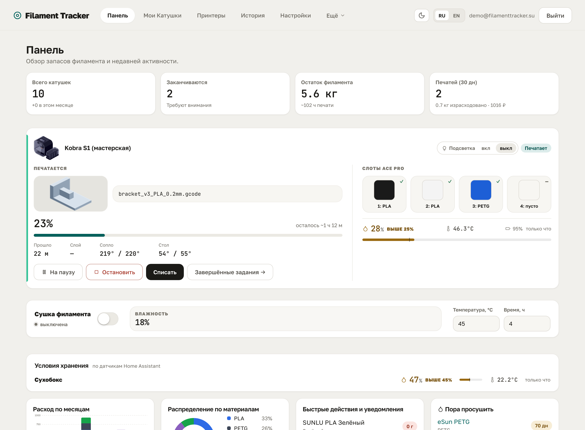
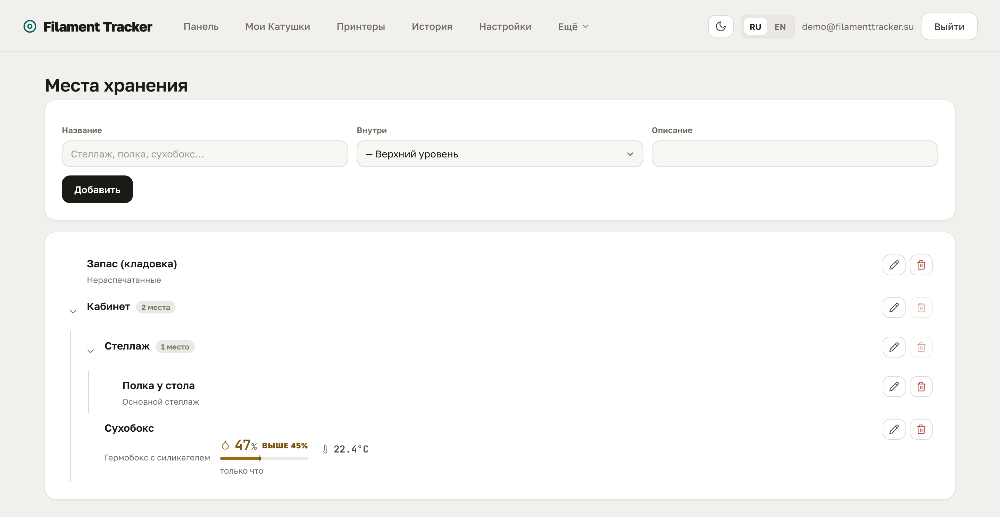

<h1 align="center">Filament Tracker</h1>

<p align="center">
  <b>Учёт филамента для 3D-печати, который живёт на вашем сервере.</b>
</p>

<p align="center">
  <a href="https://github.com/dobriys/filament_tracker/releases"></a>
  <a href="LICENSE"></a>
  <a href="https://demo.fmtracker.ru"></a>
</p>

<p align="center">
  <b>Русский</b> · <a href="README.en.md">English</a>
</p>

---

Сколько осталось на этой катушке? Хватит ли до утра? Куда ушёл весь синий PETG?

Filament Tracker отвечает на эти вопросы вместо вас. Приложение ведёт склад катушек,
само считает расход по данным принтера и предупреждает, что заканчивается, — до того
как вы обнаружите это на середине ночной печати.

Всё работает на вашем железе: домашний сервер, NAS, мини-ПК. Данные никуда не уходят.

**[Открыть живое демо →](https://demo.fmtracker.ru)** — интерфейс на готовых данных,
без установки. Работает прямо в браузере, правки хранятся локально, кнопка
«Сбросить демо» возвращает всё как было.



---

## Содержание

- [Что умеет](#что-умеет)
- [Как это выглядит](#как-это-выглядит)
- [Установка](#установка)
- [Первые шаги](#первые-шаги)
- [Уведомления в Telegram](#уведомления-в-telegram)
- [Датчики из Home Assistant](#датчики-из-home-assistant)
- [Резервные копии](#резервные-копии)
- [Если что-то сломалось](#если-что-то-сломалось)
- [Частые вопросы](#частые-вопросы)
- [Поддержать проект](#поддержать-проект)

---

## Что умеет

### Склад

- **Инвентарь катушек** — материал, цвет, остаток в граммах, место хранения, фото.
  В списке цвет филамента вынесен в полосу по краю строки, поэтому нужную катушку
  видно, не читая названий.
- **Точный остаток** — списание по весу, ручные корректировки, полная история движений.
  Порог «заканчивается» считается от размера катушки, поэтому одна настройка работает
  и для килограммовых, и для пробников.
- **Профили филамента** — шаблоны бренда и материала со всеми температурами, чтобы не
  заполнять карточку заново для каждой катушки.
- **Места хранения и слоты принтера** — видно, что лежит на полке, а что заправлено.
  Катушка в слот выбирается из списка с цветом, материалом, остатком и поиском.
- **Этикетки и QR-коды** — наклейки с живым предпросмотром, печать по одной или листом A4.
  Скан QR открывает карточку катушки с телефона.

### Принтер

- **Moonraker и Rinkhals** — статус печати прямо на главной: прогресс, слой, температуры,
  остаток времени и превью модели, которое слайсер положил в gcode.
- **Управление печатью** — пауза, продолжение и остановка из карточки принтера. Если
  прошивка защёлкнула состояние и продолжать нечего, рядом появляется сброс.
- **Прямая подача и мультиподача** — приложение само видит, идёт филамент с хаба или
  с внешнего держателя, и просит подтвердить катушки, когда подача сменилась.
- **Каталог принтеров** — 50 с лишним моделей Klipper/Moonraker (Anycubic, Creality,
  Sovol, QIDI, FLSUN, ELEGOO, Prusa и другие). Тип подключения, число слотов и
  возможности подставляются сами.
- **Списание в один клик** — расход по каждому экструдеру уже известен от принтера,
  остаётся подтвердить, с каких катушек списать.
- **Автосписание** — фоновый опрос: завершённые печати приходят сами, а при полном
  совпадении со слотами материал списывается без вашего участия.
- **Расчёт по gcode** — если принтер не подключён, загрузите файл, и приложение
  посчитает расход по каждому инструменту.

### Вокруг принтера

- **Уведомления в Telegram** — печать завершена, ошибка, пауза, сушка, катушка
  заканчивается. Каждое событие включается отдельно.
- **Датчики из Home Assistant** — температура и влажность в сушилке и на полках
  показываются там, где нужны. Выше порога — подсветка и сообщение.
- **Управление сушкой** — у совместимых хабов вроде Anycubic ACE сушка запускается
  прямо из приложения, с профилями под материал.
- **Подсветка камеры** — если принтер отдаёт лампу как устройство питания, она
  включается и выключается из карточки.

### Ваши данные

- **Импорт из Spoolman** — перенос склада из вашего
  [Spoolman](https://github.com/Donkie/Spoolman) по сети, в один клик.
- **Резервные копии** — выгрузка и восстановление в один JSON-файл: склад, история,
  настройки с ключами интеграций и даже выбранная тема.
- **Свой сервер** — вход по логину, ключи принтеров хранятся зашифрованными,
  наружу ничего не уходит.
- **Два языка** — русский и английский, переключаются на лету.

---

## Как это выглядит

### Панель

Сводка склада: сколько катушек, что заканчивается, суммарный остаток и на сколько
часов печати его хватит. Ниже — карточка каждого принтера: превью печатаемой модели,
прогресс, кнопки паузы и остановки и **«Списать»**, которая просыпается, когда печать
завершена. Дальше показания датчиков, расход по месяцам, распределение по материалам
и лента последних событий.


### Катушки

Главный список склада. Слева у каждой строки — полоса реального цвета филамента,
справа — шкала остатка в том же цвете; когда остаётся мало, она становится сначала
охряной, потом красной. Отсюда же катушку можно добавить, отредактировать,
продублировать в другом цвете, взвесить или напечатать этикетку.


Карточка катушки открывается тем, ради чего её и открывают: сколько осталось.
Намотка на шкале показывает остаток и покрашена в цвет самого филамента, рядом —
образец цвета с его кодом. Ниже, на той же странице: размещение и сушка, полные
характеристики, QR-код для этикетки и история использования.


### Принтеры

Добавляя принтер, выберите модель из каталога — остальное подставится само. Работает
с любым Klipper/Moonraker-принтером, включая Anycubic на Rinkhals: показывается только
то, что у принтера действительно есть.

Панель принтера сверяет, что стоит в слотах, с тем, что привязано в приложении,
показывает телеметрию и ресурс за всё время, а завершённые задания списываются
кнопкой рядом. Уже списанные помечаются и второй раз не спишутся. Количество
принтеров не ограничено.


### История

Все списания и корректировки: когда, по какой печати и с какой катушки ушёл материал.


### Профили филамента

Шаблоны бренда и материала: температуры, скорости, поток, параметры сушки. Каталог
[SpoolmanDB](https://github.com/Donkie/SpoolmanDB) встроен и работает офлайн — новую
катушку можно завести в пару кликов.


### Места хранения

Полки, коробки, сушилки — деревом, с вложенными местами и правкой прямо в строке.
Если к месту привязан датчик из Home Assistant, тут же видно температуру и влажность.



### Загрузка gcode

Принтер не подключён — не беда. Загрузите gcode, приложение разберёт расход по
инструментам, а вы сопоставите каждый со своей катушкой.


### Настройки

Разделы сгруппированы по смыслу, а оглавление слева заодно показывает состояние:
включён ли автоимпорт, настроен ли Telegram, сколько заведено датчиков.


---

## Установка

Нужен только Docker с Docker Compose — Linux-сервер, NAS, мини-ПК, что угодно.

```bash
git clone https://github.com/dobriys/filament_tracker.git
cd filament_tracker
./setup.sh
```

Скрипт создаст `.env`, сгенерирует секретные ключи, поднимет контейнеры и выведет
адрес интерфейса. Останется открыть **http://‹адрес-сервера›:5173** и создать учётную
запись администратора — приложение предложит это при первом входе.

Дальше пригодится:

```bash
docker compose logs -f          # смотреть логи
docker compose restart backend  # перезапустить сервис
docker compose down             # остановить
git pull && ./setup.sh          # обновить до новой версии
```

<details>
<summary><b>Установка через Portainer</b></summary>

<br>

Вставьте compose и нажмите Deploy.

1. **Stacks → Add stack → Web editor**, задайте имя, например `filament-tracker`.
2. Вставьте содержимое [`docker-compose.yml`](docker-compose.yml).
3. Раскройте **Environment variables** и задайте `POSTGRES_PASSWORD` — свой пароль базы.
   `SECRET_KEY` и `ENCRYPTION_KEY` необязательны: если не задать, приложение
   сгенерирует их при первом старте и сохранит в базе. Задайте вручную, только если
   хотите держать ключи вне базы.
4. **Deploy the stack**, затем откройте `http://‹адрес-сервера›:5173`.

Обновление — **Stacks → ваш stack → Pull and redeploy**.

</details>

<details>
<summary><b>Установка вручную, без скрипта</b></summary>

<br>

```bash
git clone https://github.com/dobriys/filament_tracker.git
cd filament_tracker
cp .env.example .env

# сгенерировать ключи и вписать их в .env
echo "SECRET_KEY=$(openssl rand -base64 48 | tr '+/' '-_' | tr -d '=')"
echo "ENCRYPTION_KEY=$(openssl rand -base64 32 | tr '+/' '-_')"

# отредактировать .env, затем:
docker compose up -d
```

</details>

---

## Первые шаги

1. Создайте учётную запись администратора при первом входе.
2. Заведите **места хранения** — полки, коробки, сушилки.
3. Добавьте **катушки**: вручную или выбрав профиль из каталога, тогда характеристики
   подставятся сами.
4. Подключите **принтер** по адресу Moonraker в разделе «Принтеры».
5. Напечатайте **этикетки** с QR-кодами и наклейте на катушки.
6. Печатайте — и списывайте расход с главной в один клик или включите автосписание.

---

## Уведомления в Telegram

Создайте бота через [@BotFather](https://t.me/BotFather), вставьте токен в настройки,
отправьте своему боту «/start» и нажмите **«Определить chat id»** — поле заполнится
само. Затем «Отправить тест» и выберите, что вам нужно:

| Событие | По умолчанию |
| --- | --- |
| Печать завершена | Вкл |
| Ошибка печати, с текстом от прошивки | Вкл |
| Печать на паузе | Вкл |
| Печать началась | Выкл |
| Печать отменена | Выкл |
| Сушка включена | Выкл |
| Сушка завершена | Вкл |
| Принтер недоступен или снова на связи | Выкл |
| Автосписание не выполнено | Вкл |
| Катушка заканчивается, порог настраивается | Вкл |
| Влажность выше порога | Вкл |

Состояние принтера отслеживает фоновый поллер, поэтому сообщения приходят и когда
приложение не открыто. Токен хранится зашифрованным и наружу не отдаётся. Пока общий
выключатель выключен, принтеры ради уведомлений не опрашиваются.

---

## Датчики из Home Assistant

Если дома есть Home Assistant, приложение покажет ваши датчики там, где они нужны:
на панели, под карточкой принтера и в списке мест хранения. Укажите адрес HA
(например `http://homeassistant.local:8123`) и токен долгосрочного доступа
(профиль в HA → «Токены долгосрочного доступа»), затем нажмите **«Загрузить список
датчиков»** — поля начнут подсказывать сущности. Откуда датчик, неважно:
zigbee2mqtt, ESPHome, Bluetooth — приложение берёт готовое состояние из HA.

Каждый датчик привязывается к принтеру, к месту хранения или показывается отдельным
блоком на панели. Влажность выше порога подсвечивается и, если включено уведомление,
уходит в Telegram.

**Порог задаётся у каждого датчика отдельно**, а общий из настроек работает как
значение по умолчанию. Одно число на всех не годится: в горячей сушилке нагрев сам по
себе занижает относительную влажность — 28 % при 46 °C по абсолютному содержанию влаги
«мокрее», чем 50 % при 22 °C. А нейлону и PVA нужен куда более жёсткий порог, чем PLA.
Ориентиры:

| Материал | Порог |
| --- | --- |
| PLA | 45–50 % |
| PETG | 40–45 % |
| ABS, ASA | 35–40 % |
| TPU | 30 % |
| PC | 25–30 % |
| PA, нейлон | 20 % |
| PVA, BVOH | 15 % |

Учитывайте точность бытовых датчиков — обычно ±3–5 % RH, так что слишком узкие пороги
смысла не имеют.

---

## Резервные копии

**Настройки → Бэкап**: полная выгрузка в JSON и восстановление из файла. Стоит делать
выгрузку перед крупными изменениями и обновлениями.

---

## Если что-то сломалось

Приложите к [issue на GitHub](https://github.com/dobriys/filament_tracker/issues)
диагностический журнал — с ним проблему видно, и исправить её намного проще:

1. **Настройки → Диагностический журнал** → включите «Записывать действия и ошибки».
2. Повторите действия, на которых возникает проблема.
3. Нажмите **«Скачать (.txt)»** и приложите файл к issue. Опишите, что делали и что
   ожидали увидеть.
4. После отправки запись можно выключить, а журнал очистить.

Секреты — пароли и ключи — вырезаются из журнала автоматически, но перед публикацией
его всё равно стоит просмотреть.

---

## Частые вопросы

**Нужен ли принтер с Moonraker?**
Нет. Без принтера ведите склад вручную и списывайте расход, загружая gcode. С Moonraker
(в том числе Rinkhals на Anycubic) списание становится почти автоматическим.

**Какие принтеры поддерживаются?**
Любой с Moonraker. В каталоге больше 50 моделей — Anycubic, Creality, Sovol, QIDI,
FLSUN, ELEGOO, Kingroon, Artillery, BIQU, Prusa и другие. Если вашей модели нет,
выберите «Klipper / Moonraker», и возможности определятся сами. Bambu Lab пока
не поддерживается.

**В начале печати не видно, сколько осталось по времени. Почему?**
Оценка появляется после ~2 % прогресса. Она считается по прошедшему времени, и при
почти нулевом прогрессе результат недостоверен — легко получить «сотни часов».
Как только прогресс перевалит порог, остаток появится сам.

**Уже веду учёт в Spoolman. Переносить всё заново?**
Нет. В **Настройки → Импорт из Spoolman** укажите адрес — катушки перенесутся сами.
Повторный импорт пропускает уже добавленные.

**Данные уходят в облако?**
Нет. Всё работает на вашем сервере и хранится в вашей базе.

**Забыл пароль администратора.**
Сбросьте хеш пароля прямо в базе или, если данные не жалко, очистите таблицу `users` —
при следующем входе приложение снова предложит создать администратора.

---

## Поддержать проект

Проект бесплатный и с открытым исходным кодом. Если он вам пригодился, поддержать
разработку можно на [Boosty](https://boosty.to/fmtracker/donate).

---

## Благодарности

Каталог филамента для автозаполнения — снапшот
[SpoolmanDB](https://github.com/Donkie/SpoolmanDB) под лицензией MIT. Полный текст
лицензии и атрибуция — в [NOTICE.md](NOTICE.md).

---

<p align="center">
  <sub>Self-hosted · ваши данные остаются у вас · интерфейс на русском и английском</sub>
</p>
