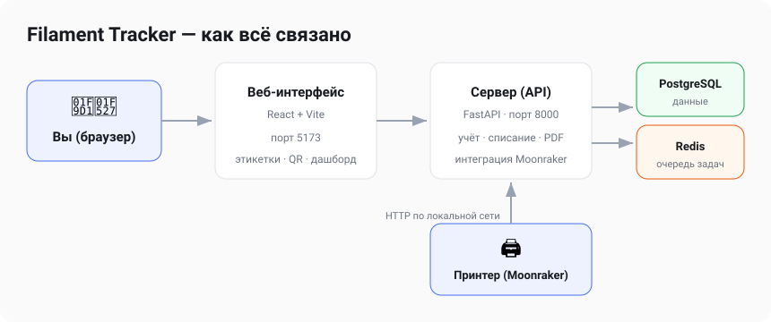

# 🧵 Filament Tracker

**Учёт филамента для 3D-печати, который вы разворачиваете на своём сервере.**

Сколько катушек осталось, что где лежит, на сколько ещё хватит пластика и куда
он ушёл — всё в одном месте. Приложение само считает расход по данным принтера
(Moonraker) или по загруженному gcode, печатает этикетки с QR-кодом и хранит все
данные только у вас. Интерфейс на русском и английском (переключатель в шапке).


---

## Содержание

- [Что умеет](#что-умеет)
- [Возможности по разделам](#возможности-по-разделам)
- [Как это устроено](#как-это-устроено)
- [Установка на свой сервер (Docker)](#установка-на-свой-сервер-docker)
- [Установка через Portainer](#установка-через-portainer)
- [Настройки окружения](#настройки-окружения-env)
- [Доступ из локальной сети и по домену](#доступ-из-локальной-сети-и-по-домену)
- [Первые шаги после установки](#первые-шаги-после-установки)
- [Резервные копии](#резервные-копии)
- [Частые вопросы](#частые-вопросы)

---

## Что умеет

- 📦 **Инвентарь катушек** — материал, цвет, остаток в граммах, место хранения, фото.
- ⚖️ **Точный остаток** — списание по весу, ручные корректировки, полная история движений.
- 🖨️ **Интеграция с принтером (Moonraker / Rinkhals)** — статус печати прямо на главной
  и списание израсходованного пластика в один клик по завершении задания.
- 🤖 **Автосписание** — фоновый опрос принтера: завершённые печати импортируются сами,
  а при полном сопоставлении со слотами материал списывается автоматически (опция).
- 📄 **Расчёт по gcode** — загрузите файл, приложение посчитает расход по каждому
  экструдеру и спишет с нужных катушек.
- 🏷️ **Этикетки и QR-коды** — печать наклеек с живым предпросмотром; скан QR открывает
  карточку катушки.
- 📊 **Дашборд** — остаток по материалам, расход по месяцам, что заканчивается,
  недавняя активность.
- 🗂️ **Профили филамента, места хранения, слоты принтера** — гибкая организация склада.
- 💾 **Бэкап в JSON** — выгрузка и восстановление всех данных.
- 🔐 **Свой сервер, свои данные** — авторизация по логину, ключи принтеров хранятся
  в зашифрованном виде.

---

## Возможности по разделам

### 📊 Панель (главная)

Сводка склада: всего катушек, сколько заканчивается, суммарный остаток и оценка
часов печати, расход за 30 дней. Ниже — виджет каждого подключённого принтера с
живым статусом печати (прогресс, температуры, оставшееся время) и кнопкой
**«Списать»**, которая активируется, когда печать завершена. Также — график расхода
по месяцам, распределение по материалам и лента недавних событий.


### 📦 Катушки

Главный список склада. По каждой катушке видно материал и цвет, остаток, где она
сейчас находится (место хранения или слот принтера) и быстрые действия. Отсюда же
можно добавить катушку, отредактировать, продублировать (в том числе «в другом
цвете»), взвесить, скорректировать остаток и напечатать этикетку.


Карточка катушки: остаток, рекомендуемый профиль печати, история использования,
QR-код с кнопкой печати этикетки, размещение и полные характеристики филамента.


### 🏷️ Этикетки и QR-коды

Для каждой катушки формируется наклейка с производителем, материалом, кодом цвета
и выбранными характеристиками (температуры, flow, pressure advance и т.д.).
**Живой предпросмотр** показывает результат сразу при выборе размера и полей.
Доступны разные размеры (в том числе вертикальные). Печать — в PDF (по одной или
листом A4). QR-код на этикетке открывает приватную карточку катушки.

### 🖨️ Принтеры и Moonraker

Подключите принтер по адресу Moonraker (совместимо с Rinkhals на Anycubic).
Приложение показывает состояние принтера и историю заданий. Для завершённого
задания достаточно нажать **«Списать»** — расход по каждому экструдеру уже известен
из данных принтера, останется только подтвердить, с каких катушек списать.
Уже списанные задания помечаются и повторно не списываются.


### 📄 Загрузка gcode

Если принтер не подключён, загрузите gcode-файл вручную. Приложение распарсит
расход по инструментам (T0, T1, …), а вы сопоставите каждый инструмент с катушкой
из склада и спишете материал.


### 🗂️ Профили, места хранения, слоты

- **Профили филамента** — шаблоны (бренд, материал, температуры, характеристики),
  чтобы не заполнять всё вручную для каждой катушки.
- **Места хранения** — полки, коробки, сушилки; видно, что где лежит.
- **Слоты принтера** — какая катушка стоит в каком слоте, с историей назначений
  (управление — на странице «Принтеры»).


### 📜 История

Все списания и корректировки: когда, по какой печати и с какой катушки был списан
материал.


### ⚙️ Настройки

- **Бэкап** — скачать все данные в JSON и восстановить из файла.
- **Moonraker: автоматизация** — автоимпорт завершённых печатей (вкл. по умолчанию)
  и полное автосписание при сопоставлении со слотами (опция).
- **Списание** — разрешить уход остатка в минус (только администратор).


---

## Как это устроено

Приложение состоит из нескольких контейнеров, которые поднимаются одной командой:



| Компонент | Роль | Порт |
|-----------|------|------|
| **frontend** | Веб-интерфейс (статика React под nginx) | `5173` |
| **backend** | API (uvicorn, 2 воркера), вся логика, PDF/QR | `8000` |
| **db** | PostgreSQL — хранит данные | `5432` |
| **redis** | очередь фоновых задач | `6379` |
| **worker** | фоновая синхронизация с принтером (автоимпорт/автосписание) | — |

---

## Установка на свой сервер (Docker)

**Требуется:** Docker и Docker Compose (Linux-сервер, NAS, мини-ПК — что угодно).

Три команды — и всё готово:

```bash
git clone https://github.com/dobriys/filament_tracker.git
cd filament_tracker
./setup.sh
```

Скрипт `setup.sh` сам создаст `.env`, **сгенерирует секретные ключи** и поднимет
контейнеры из готовых образов (сборка из исходников — `./build.sh`).
По окончании он выведет адрес интерфейса. Повторный запуск безопасен и
обновляет образы — существующий `.env` и ключи не перезаписываются.

После запуска:

- Интерфейс — **http://<адрес-сервера>:5173**
- При первом входе сервис предложит **создать учётную запись администратора**
  (email + пароль) — преднастроенных логинов нет.

Полезные команды:

```bash
docker compose logs -f          # смотреть логи
docker compose restart backend  # перезапустить сервис
docker compose down             # остановить (данные сохраняются в томе)
git pull && ./setup.sh          # обновить до новой версии
```

> ⚠️ **Смените пароль БД по умолчанию** (`POSTGRES_PASSWORD` в `.env`) перед
> «боевым» запуском. Секретные ключи `setup.sh` уже сгенерировал за вас, а
> администратора вы создадите сами при первом входе.

<details>
<summary>Установка вручную (без скрипта)</summary>

```bash
git clone https://github.com/dobriys/filament_tracker.git
cd filament_tracker
cp .env.example .env

# сгенерировать ключи и вписать их в .env
echo "SECRET_KEY=$(openssl rand -base64 48 | tr '+/' '-_' | tr -d '=')"
echo "ENCRYPTION_KEY=$(openssl rand -base64 32 | tr '+/' '-_')"

# отредактировать .env (пароли, при необходимости адреса для сети), затем:
docker compose up -d          # готовые образы из GHCR
# или сборка из исходников: ./build.sh && docker compose up -d
```
</details>

---

## Установка через Portainer

Готовые образы публикуются в GitHub Container Registry автоматически, поэтому в
Portainer **ничего собирать не нужно** — просто вставьте compose и нажмите Deploy.

1. **Stacks → Add stack → Web editor**, задайте имя (например `filament-tracker`).
2. Вставьте содержимое файла [`docker-compose.yml`](docker-compose.yml) —
   он один и тот же для всех способов установки.
3. Раскройте **Environment variables** и добавьте как минимум
   `SECRET_KEY`, `ENCRYPTION_KEY` (сгенерируйте, см. ниже) и
   `POSTGRES_PASSWORD` — свой пароль БД.
4. **Deploy the stack** и откройте `http://<адрес-сервера>:5173`.

Сгенерировать ключи (на любой машине):

```bash
echo "SECRET_KEY=$(openssl rand -base64 48 | tr '+/' '-_' | tr -d '=')"
echo "ENCRYPTION_KEY=$(openssl rand -base64 32 | tr '+/' '-_')"
```

Обновление: **Stacks → ваш stack → Pull and redeploy** — Portainer подтянет
свежие образы `:latest`.

> 📌 **Фиксация версии.** Каждый релиз публикует версионированные теги образов
> (`1.0.0`, `1.0`). Чтобы не обновляться незаметно вместе с `:latest`, задайте
> переменную `FT_VERSION=1.0.0` (в Environment variables стека или в `.env`) —
> и стек будет держаться этой версии, пока вы сами её не смените.
> Список версий — на странице [Releases](https://github.com/dobriys/filament_tracker/releases).

---

## Настройки окружения (.env)

| Переменная | Назначение | Пример / рекомендация |
|-----------|-----------|-----------------------|
| `POSTGRES_USER` | пользователь БД | `filament` |
| `POSTGRES_PASSWORD` | **пароль БД** | придумайте свой |
| `POSTGRES_DB` | имя базы | `filament_tracker` |
| `SECRET_KEY` | подпись сессий/токенов | случайная строка (см. команду выше) |
| `ENCRYPTION_KEY` | шифрование ключей принтеров (Fernet) | сгенерировать (см. команду выше) |
| `ACCESS_TOKEN_EXPIRE_MINUTES` | срок жизни входа | `1440` (сутки) |
| `CORS_ORIGINS` | откуда разрешён доступ к API | адрес интерфейса, см. ниже |
| `FRONTEND_BASE_URL` | адрес, зашиваемый в QR-код катушки | адрес интерфейса, см. ниже |
| `VITE_API_BASE_URL` | адрес API для интерфейса | адрес сервера:8000, см. ниже |

---

## Доступ из локальной сети и по домену

**Из локальной сети всё работает сразу, без настройки.** Установили на сервер
`192.168.0.200` → открываете `http://192.168.0.200:5173` с любого устройства —
интерфейс сам обращается к API на том же адресе (порт `8000`), и QR-коды на
этикетках тоже строятся от адреса, с которого вы зашли.

Как это работает: адрес API выводится из адресной строки браузера, CORS по
умолчанию открыт (безопасно — авторизация по токену в заголовке, без кук),
а ссылка для QR берётся из адреса текущего запроса.

Переменные `VITE_API_BASE_URL`, `FRONTEND_BASE_URL` и `CORS_ORIGINS` нужны
**только за reverse-proxy / доменом**:

- **Домен / HTTPS.** Если ставите за reverse-proxy (Nginx Proxy Manager, Traefik,
  Caddy) и API проксируется на отдельный адрес — укажите его явно:

  ```env
  VITE_API_BASE_URL=https://api.filament.example.com
  FRONTEND_BASE_URL=https://filament.example.com
  CORS_ORIGINS=https://filament.example.com
  ```

  После изменения — `docker compose up -d` (или Pull and redeploy в Portainer).

> 🖨️ **Сервер в другом месте, а принтер дома?** Чтобы live-статус Moonraker и
> списание работали, сервер должен видеть принтер по сети. Готовая инструкция по
> WireGuard-туннелю (OpenWrt / Raspberry Pi / Linux-сервер) —
> [docs/vpn-printer.md](docs/vpn-printer.md).

---

## Первые шаги после установки

1. При первом входе создайте учётную запись администратора.
2. (Опционально) создайте **профили филамента** для брендов, которыми печатаете.
3. Добавьте **места хранения** (полки, сушилки).
4. Добавьте первые **катушки** — вручную или на основе профиля.
5. Подключите **принтер** по адресу Moonraker (раздел «Принтеры»).
6. Напечатайте **этикетки** с QR и наклейте на катушки.
7. Печатайте — и списывайте расход с главной страницы в один клик.

---

## Резервные копии

Все данные лежат в томе PostgreSQL (`postgres_data`) и переживают перезапуск и
обновление контейнеров.

Дополнительно в разделе **Настройки → Бэкап** можно скачать полную выгрузку в JSON
и восстановить из неё (данные добавляются, а не перезаписываются). Рекомендуется
делать выгрузку перед крупными изменениями.

---

## Частые вопросы

**Нужен ли принтер с Moonraker?**
Нет. Без принтера ведите склад вручную и списывайте расход, загружая gcode-файлы.
С Moonraker (в т.ч. Rinkhals на Anycubic) списание становится полуавтоматическим.

**Данные уходят в облако?**
Нет. Всё работает на вашем сервере, данные хранятся локально в вашей базе.

**Забыл пароль администратора.**
Сбросьте хеш пароля прямо в БД или (если данные не жалко) очистите таблицу
`users` — при следующем входе сервис снова предложит создать администратора.

**Порты 5173/8000 заняты.**
Поменяйте левую часть в `ports:` в `docker-compose.yml` (например `8080:5173`) и
приведите к ним `CORS_ORIGINS` / `FRONTEND_BASE_URL` / `VITE_API_BASE_URL`.

---

<p align="center"><sub>Self-hosted · ваши данные остаются у вас · интерфейс на русском</sub></p>
