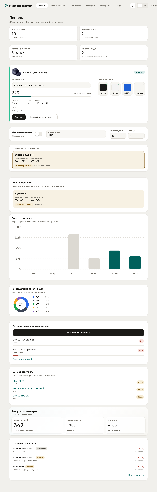
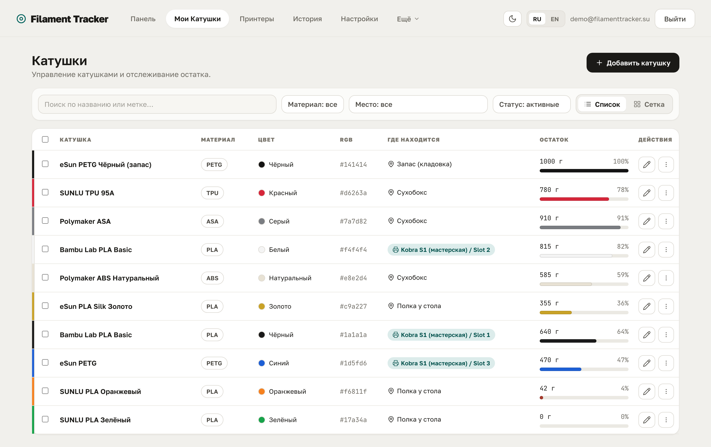
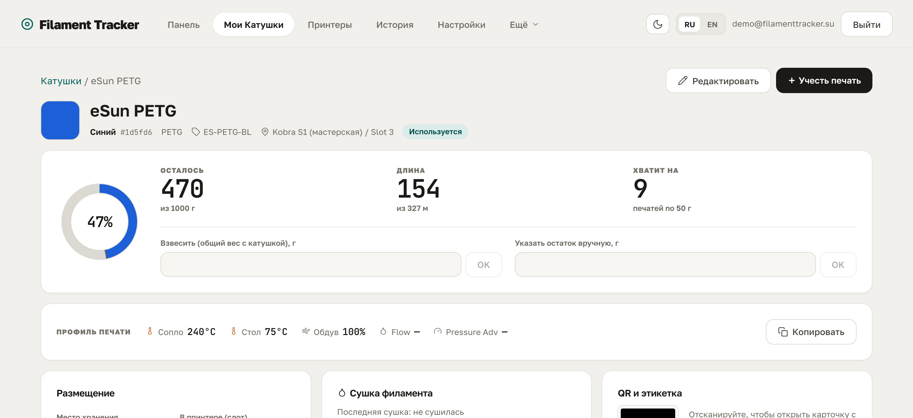
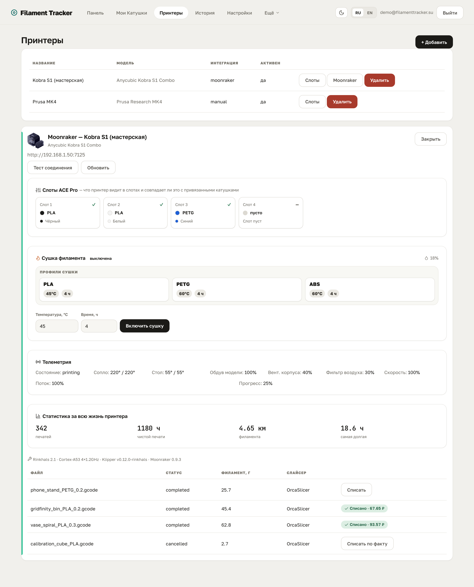
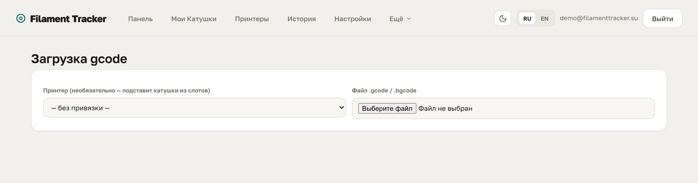
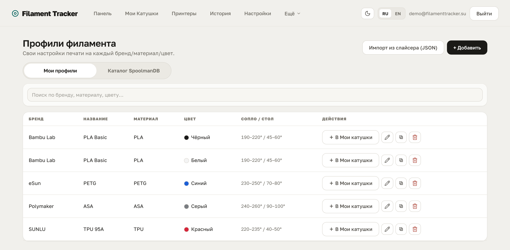
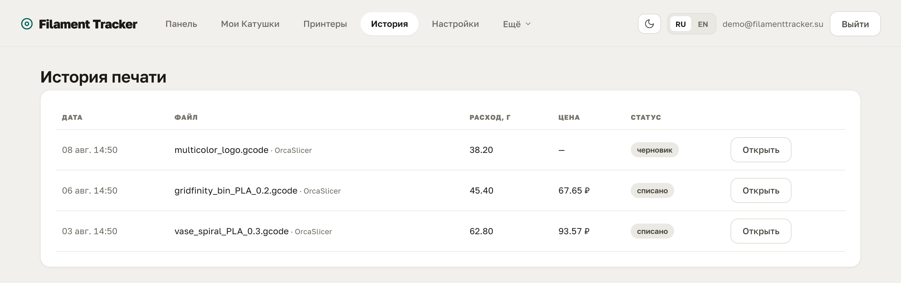
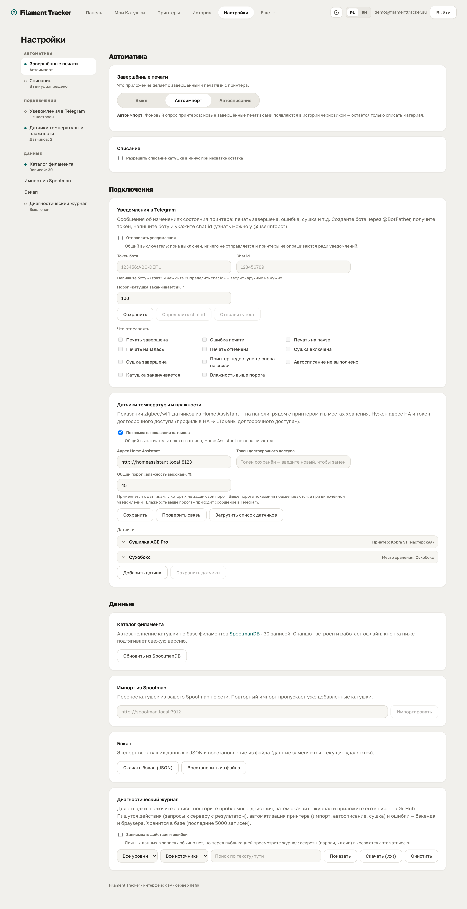

# 🧵 Filament Tracker

[English](README.md) · **Русский**

**Учёт филамента для 3D-печати, который вы разворачиваете на своём сервере.**

Сколько катушек осталось, что где лежит, на сколько ещё хватит пластика и куда
он ушёл — всё в одном месте. Приложение само считает расход по данным принтера
(Moonraker) или по загруженному gcode, печатает этикетки с QR-кодом и хранит все
данные только у вас. Интерфейс на русском и английском.



---

## Содержание

- [Что умеет](#что-умеет)
- [Возможности по разделам](#возможности-по-разделам)
- [Установка на свой сервер (Docker)](#установка-на-свой-сервер-docker)
- [Установка через Portainer](#установка-через-portainer)
- [Первые шаги после установки](#первые-шаги-после-установки)
- [Резервные копии](#резервные-копии)
- [Частые вопросы](#частые-вопросы)

---

## Что умеет

- 📦 **Инвентарь катушек** — материал, цвет, остаток в граммах, место хранения, фото.
- ⚖️ **Точный остаток** — списание по весу, ручные корректировки, полная история движений.
- 🖨️ **Интеграция с принтером (Moonraker / Rinkhals)** — статус печати прямо на главной
  и списание израсходованного пластика в один клик по завершении задания.
- 🗂️ **Каталог принтеров** — выбор модели из 50+ совместимых Klipper/Moonraker-принтеров
  (Anycubic, Creality, Sovol, QIDI, FLSUN, ELEGOO, Prusa и др.). Карточка сама
  показывает то, что есть у принтера — слоты мультиподачи, сушилку, камеру — и рисует
  силуэт с акцентом бренда.
- 🧵 **Импорт из Spoolman** — перенос катушек из вашего self-hosted
  [Spoolman](https://github.com/Donkie/Spoolman) по сети в один клик.
- 🤖 **Автосписание** — фоновый опрос принтера: завершённые печати импортируются сами,
  а при полном сопоставлении со слотами материал списывается автоматически (опция).
- 📄 **Расчёт по gcode** — загрузите файл, приложение посчитает расход по каждому
  экструдеру и спишет с нужных катушек.
- 🏷️ **Этикетки и QR-коды** — печать наклеек с живым предпросмотром; скан QR открывает
  карточку катушки.
- 📊 **Дашборд** — остаток по материалам, расход по месяцам, что заканчивается,
  недавняя активность.
- 🗂️ **Профили филамента, места хранения, слоты принтера** — гибкая организация склада.
- 💾 **Бэкап в JSON** — выгрузка и восстановление всех данных.
- 🔐 **Свой сервер, свои данные** — авторизация по логину, ключи принтеров хранятся
  в зашифрованном виде.

---

## Возможности по разделам

### 📊 Панель (главная)

Сводка склада: всего катушек, сколько заканчивается, суммарный остаток и оценка
часов печати, расход за 30 дней. Ниже — виджет каждого подключённого принтера с
живым статусом печати (прогресс, температуры, оставшееся время) и кнопкой
**«Списать»**, которая активируется, когда печать завершена. Также — график расхода
по месяцам, распределение по материалам и лента недавних событий.


### 📦 Катушки

Главный список склада. По каждой катушке видно материал и цвет, остаток, где она
сейчас находится (место хранения или слот принтера) и быстрые действия. Отсюда же
можно добавить катушку, отредактировать, продублировать (в том числе «в другом
цвете»), взвесить, скорректировать остаток и напечатать этикетку.



Карточка катушки: остаток, рекомендуемый профиль печати, история использования,
QR-код с кнопкой печати этикетки, размещение и полные характеристики филамента.



### 🏷️ Этикетки и QR-коды

Для каждой катушки формируется наклейка с производителем, материалом, кодом цвета
и выбранными характеристиками (температуры, flow, pressure advance и т.д.).
**Живой предпросмотр** показывает результат сразу при выборе размера и полей.
Доступны разные размеры (в том числе вертикальные). Печать — в PDF (по одной или
листом A4). QR-код на этикетке открывает приватную карточку катушки.

### 🖨️ Принтеры и Moonraker

Добавляя принтер, выберите модель из каталога — тип подключения, число слотов и
возможности (мультиподача, сушилка, камера) подставятся сами, а на карточке появится
силуэт с акцентом бренда. Работает с любым Klipper/Moonraker-принтером (в т.ч.
Anycubic на Rinkhals): что есть у принтера — то и показывается, лишние блоки не
мешают. У совместимых хабов (например Anycubic ACE) сушкой можно управлять прямо
из приложения.

Приложение показывает состояние принтера и историю заданий. Для завершённого
задания достаточно нажать **«Списать»** — расход по каждому экструдеру уже известен
из данных принтера, останется только подтвердить, с каких катушек списать.
Уже списанные задания помечаются и повторно не списываются.



### 📄 Загрузка gcode

Если принтер не подключён, загрузите gcode-файл вручную. Приложение распарсит
расход по инструментам (T0, T1, …), а вы сопоставите каждый инструмент с катушкой
из склада и спишете материал.



### 🗂️ Профили, места хранения, слоты

- **Профили филамента** — шаблоны (бренд, материал, температуры, характеристики),
  чтобы не заполнять всё вручную для каждой катушки.
- **Места хранения** — полки, коробки, сушилки; видно, что где лежит.
- **Слоты принтера** — какая катушка стоит в каком слоте, с историей назначений
  (управление — на странице «Принтеры»).



### 📜 История

Все списания и корректировки: когда, по какой печати и с какой катушки был списан
материал.



### ⚙️ Настройки

- **Бэкап** — скачать все данные в JSON и восстановить из файла.
- **Импорт из Spoolman** — укажите адрес вашего Spoolman, и катушки перенесутся в
  склад (производитель, материал, цвет, вес, остаток, локация). Повторный импорт
  пропускает уже добавленные.
- **Moonraker: автоматизация** — автоимпорт завершённых печатей (вкл. по умолчанию)
  и полное автосписание при сопоставлении со слотами (опция).
- **Списание** — разрешить уход остатка в минус (только администратор).



---


## Установка на свой сервер (Docker)

**Требуется:** Docker и Docker Compose (Linux-сервер, NAS, мини-ПК — что угодно).

Три команды — и всё готово:

```bash
git clone https://github.com/dobriys/filament_tracker.git
cd filament_tracker
./setup.sh
```

Скрипт `setup.sh` сам создаст `.env`, **сгенерирует секретные ключи** и поднимет
контейнеры из готовых образов.
По окончании он выведет адрес интерфейса.

После запуска:

- Интерфейс — **http://<адрес-сервера>:5173**
- При первом входе сервис предложит **создать учётную запись администратора**
  (email + пароль).

Полезные команды:

```bash
docker compose logs -f          # смотреть логи
docker compose restart backend  # перезапустить сервис
docker compose down             # остановить
git pull && ./setup.sh          # обновить до новой версии
```


<details>
<summary>Установка вручную (без скрипта)</summary>

```bash
git clone https://github.com/dobriys/filament_tracker.git
cd filament_tracker
cp .env.example .env

# сгенерировать ключи и вписать их в .env
echo "SECRET_KEY=$(openssl rand -base64 48 | tr '+/' '-_' | tr -d '=')"
echo "ENCRYPTION_KEY=$(openssl rand -base64 32 | tr '+/' '-_')"

# отредактировать .env , затем:
docker compose up -d          
```
</details>

---

## Установка через Portainer

Просто вставьте compose и нажмите Deploy.

1. **Stacks → Add stack → Web editor**, задайте имя (например `filament-tracker`).
2. Вставьте содержимое файла [`docker-compose.yml`](docker-compose.yml)
3. Раскройте **Environment variables** и добавьте как минимум
   `SECRET_KEY`, `ENCRYPTION_KEY` (сгенерируйте, см. ниже) и
   `POSTGRES_PASSWORD` — свой пароль БД.
4. **Deploy the stack** и откройте `http://<адрес-сервера>:5173`.

Сгенерировать ключи (на любой машине):

```bash
echo "SECRET_KEY=$(openssl rand -base64 48 | tr '+/' '-_' | tr -d '=')"
echo "ENCRYPTION_KEY=$(openssl rand -base64 32 | tr '+/' '-_')"
```

Обновление: **Stacks → ваш stack → Pull and redeploy** — Portainer подтянет
свежие образы.

---


## Первые шаги после установки

1. При первом входе создайте учётную запись администратора.
2. (Опционально) создайте **профили филамента** для брендов, которыми печатаете.
3. Добавьте **места хранения** (полки, сушилки).
4. Добавьте первые **катушки** — вручную или на основе профиля.
5. Подключите **принтер** по адресу Moonraker (раздел «Принтеры»).
6. Напечатайте **этикетки** с QR и наклейте на катушки.
7. Печатайте — и списывайте расход с главной страницы в один клик.

---

## Резервные копии

В разделе **Настройки → Бэкап** можно скачать полную выгрузку в JSON
и восстановить из неё (данные добавляются, а не перезаписываются). Рекомендуется
делать выгрузку перед крупными изменениями.

---

## Частые вопросы

**Нужен ли принтер с Moonraker?**
Нет. Без принтера ведите склад вручную и списывайте расход, загружая gcode-файлы.
С Moonraker (в т.ч. Rinkhals на Anycubic) списание становится полуавтоматическим.

**Какие принтеры поддерживаются?**
Любой принтер с Moonraker: в каталоге уже 50+ моделей (Anycubic, Creality, Sovol,
QIDI, FLSUN, ELEGOO, Kingroon, Artillery, BIQU, Prusa и др.), но подойдёт и любой
другой Klipper/Moonraker-принтер — выберите «Klipper / Moonraker», и возможности
определятся сами. Bambu Lab пока не поддерживается.

**Уже веду учёт в Spoolman — переносить всё заново?**
Нет. В **Настройки → Импорт из Spoolman** укажите адрес вашего Spoolman — катушки
перенесутся автоматически.

**Данные уходят в облако?**
Нет. Всё работает на вашем сервере, данные хранятся локально в вашей базе.

**Забыл пароль администратора.**
Сбросьте хеш пароля прямо в БД или (если данные не жалко) очистите таблицу
`users` — при следующем входе сервис снова предложит создать администратора.


---

<p align="center"><sub>Self-hosted · ваши данные остаются у вас · интерфейс на русском и английском</sub></p>
